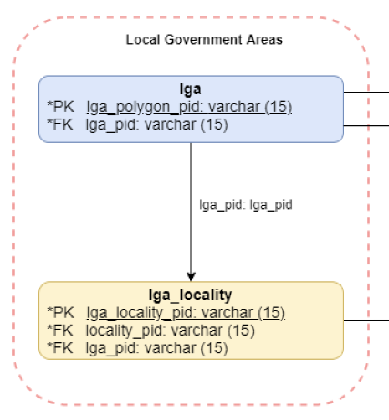

# Splunking Queensland Health COVID Data

## Splunk-side things

I've turned this into an app - the file's at `qld_covid_data.spl`.

### Macros


| Macro name | Default Value | Description |
| --- | --- | --- |
| `qldcovid_sourcedata` | `sourcetype="qldcovid:contacts"` | Where you sent the data through the ingester |
| `qldcovid_lgadata` | `| inputlookup qldcovid_lga` | LGA Data from the lookup |

### Enabling the input

Look for the script called `qld_covid_contacts.py` - there's a default cron schedule of every hour.

# Notes about LGA Data 

## What are these LGA IDs?

After much muttering and searching I found [this boundary on OpenStreetMap](https://www.openstreetmap.org/relation/5656285#map=9/-24.8752/152.4408)

Which led me to this: https://wiki.openstreetmap.org/wiki/Import/Catalogue/PSMA_Admin_Boundaries

In this document: https://geoscape.com.au/wp-content/uploads/2021/08/Local-Government-Areas-Product-Guide-v1.0.pdf



## Extracting the data
I extracted it from the data in https://github.com/FrakGart/psma-admin-bdy-2020-08 using `osmfinder.py`.

Grabbing the source data:

```
git clone --depth 1 https://github.com/FrakGart/psma-admin-bdy-2020-08 
```

Some other files need decompression:

```
xz -d psma-admin-bdy-2020-08/act_2020-08.osm.xz
xz -d psma-admin-bdy-2020-08/nsw_2020-08.osm.xz
xz -d psma-admin-bdy-2020-08/sa_2020-08.osm.xz
xz -d psma-admin-bdy-2020-08/tas_2020-08.osm.xz
```

There's no "level 6" admin boundary defined for ACT... in this data anyway.

## Generating the LGA data

Run `osmfinder.py` - it'll update the lookup csv file in the app.

# Finally 

Eat some cake 🍰

# Credits:

 - App icon by [NawIcon](https://thenounproject.com/nawiconstudio/)  from The Noun Project - https://thenounproject.com/icon/virus-3364075/
 - [Requests](https://docs.python-requests.org/en/master/index.html) is HTTP for Humans. 
 - [BeautifulSoup4](http://beautiful-soup-4.readthedocs.io) for parsing HTML.
 - [dateutil](https://pypi.org/project/python-dateutil/) for timezones.
 - [lxml](https://pypi.org/project/python-dateutil/) else we'd never get any XML done.
 - [openstreetmap](http://openstreetmap.org) because they had done the hard yards on the LGA info.
 